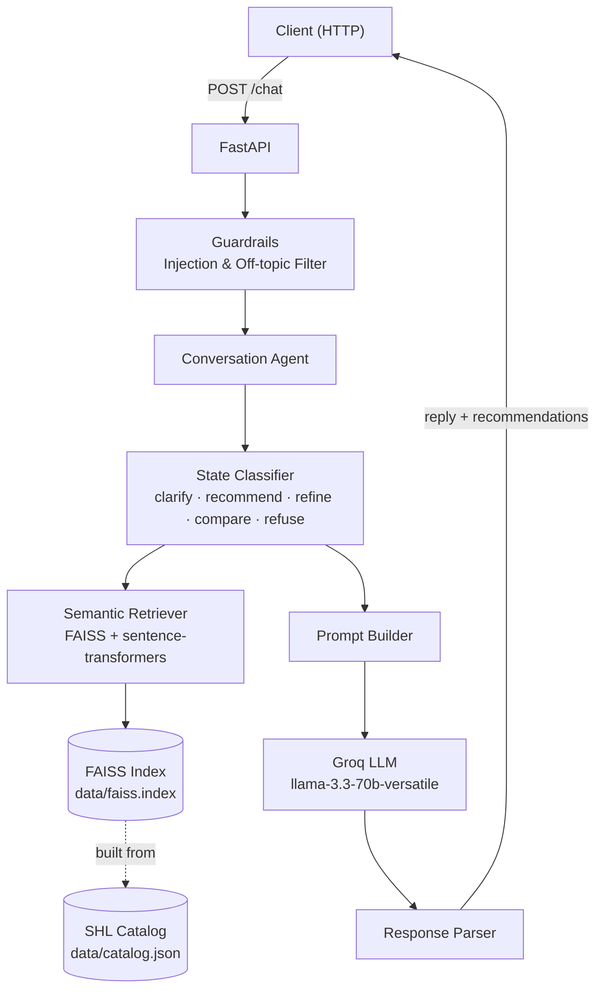
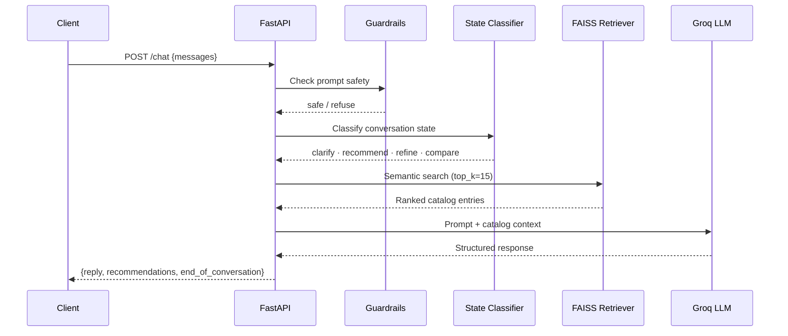
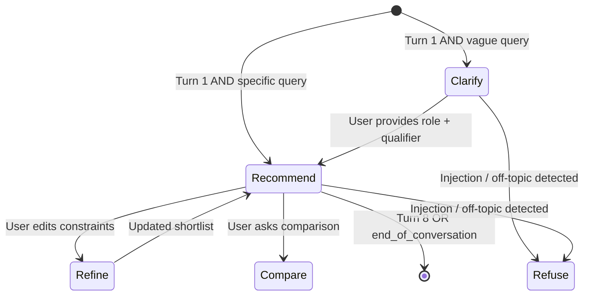

# SHL Assessment Recommender

A stateless, production-grade REST API that uses a **Retrieval-Augmented Generation (RAG)** pipeline to guide hiring professionals from a vague intent to a catalog-grounded shortlist of SHL Individual Test Solutions through natural dialogue.

**Live Demo:** [vedit2101-shl-assessment-recommender.hf.space](https://vedit2101-shl-assessment-recommender.hf.space)  
**API Docs:** [/docs](https://vedit2101-shl-assessment-recommender.hf.space/docs)

---

## Architecture

### System Overview



### Request Flow



### Conversation State Machine



---

## File Structure

```text
shl-assessment-recommender/
│
├── app/                        # FastAPI service layer
│   ├── main.py                 # App entry point, lifespan, router mounts
│   ├── config.py               # Pydantic settings (env vars)
│   ├── routers/
│   │   ├── health.py           # GET /health
│   │   └── chat.py             # POST /chat
│   ├── models/
│   │   ├── request.py          # ChatRequest schema
│   │   └── response.py         # ChatResponse schema
│   └── middleware/             # (reserved for future middleware)
│
├── agent/                      # Conversation agent (core logic)
│   ├── agent.py                # Main agent orchestrator
│   ├── state_classifier.py     # Classifies turn into a state
│   ├── prompt_builder.py       # Builds LLM prompt per state
│   ├── response_parser.py      # Parses LLM output → structured response
│   └── guardrails.py           # Prompt injection & off-topic detection
│
├── retrieval/                  # RAG retrieval layer
│   ├── embedder.py             # sentence-transformers wrapper
│   ├── vector_store.py         # FAISS index load/query
│   └── retriever.py            # Semantic search orchestrator
│
├── ingestion/                  # Catalog ingestion pipeline
│   ├── scraper.py              # SHL catalog scraper (with static fallback)
│   ├── parser.py               # Raw entry → validated CatalogEntry
│   └── indexer.py              # Embed + build FAISS index
│
├── data/
│   ├── catalog.json            # SHL catalog (source of truth)
│   ├── faiss.index             # Built at Docker build time
│   └── catalog_metadata.json   # Metadata aligned with FAISS vectors
│
├── scripts/
│   ├── build_index.py          # One-shot ingestion: scrape → embed → index
│   └── run_eval.py             # Run evaluation harness against live API
│
├── evaluation/
│   ├── harness.py              # Sends traces to /chat, collects responses
│   ├── metrics.py              # Schema, recall, URL, turn-cap, hallucination
│   └── traces/                 # Golden test traces (trace_01.json … trace_05.json)
│
├── tests/                      # pytest test suite
│   ├── test_health.py
│   ├── test_chat_schema.py
│   ├── test_agent_behaviors.py
│   ├── test_guardrails.py
│   └── test_retrieval.py
│
├── Dockerfile                  # Multi-step: install → build index → serve
├── .env.example                # Environment variable template
├── requirements.txt
└── pyproject.toml              # pytest config
```

---

## API Reference

### `GET /health`

```json
{"status": "ok"}
```

### `POST /chat`

#### Request

```json
{
  "messages": [
    {"role": "user", "content": "I need to hire a mid-level Java developer."},
    {"role": "assistant", "content": "..."},
    {"role": "user", "content": "Focus on problem solving and coding skills."}
  ]
}
```

#### Response

```json
{
  "reply": "Based on your requirements, here are the SHL assessments I recommend...",
  "recommendations": [
    {
      "name": "Java 8 (New)",
      "url": "https://www.shl.com/solutions/products/product-catalog/view/java-8-new/",
      "test_type": ["Knowledge & Skills"]
    }
  ],
  "end_of_conversation": false
}
```

#### Rules

- Max **8 user turns** per conversation — send a fresh `messages` array per session
- All recommendations are grounded in the SHL catalog — zero hallucination
- 30-second request timeout enforced server-side

---

## Conversation Behavior

| State | Trigger | Action |
| --- | --- | --- |
| **Clarify** | Turn 1 AND vague query | Ask one focused clarifying question |
| **Recommend** | Sufficient context (role + qualifier) | Return 3–10 catalog-grounded assessments |
| **Refine** | User edits constraints | Update the shortlist |
| **Compare** | User asks comparison | Compare specific assessments |
| **Refuse** | Prompt injection / off-topic | Polite refusal, no recommendations |

---

## Local Development

### 1. Install dependencies

```bash
pip install -r requirements.txt
```

### 2. Configure environment

```bash
cp .env.example .env
# Fill in your Groq API key in .env
```

### 3. Build the FAISS index

```bash
python scripts/build_index.py
```

### 4. Start the API

```bash
uvicorn app.main:app --host 0.0.0.0 --port 8000 --reload
```

### 5. Run tests

```bash
pytest tests/ -v
```

### 6. Run evaluation (API must be running)

```bash
python scripts/run_eval.py --base-url http://localhost:8000
```

---

## Docker

```bash
docker build -t shl-recommender .
docker run -p 8000:8000 --env-file .env shl-recommender
```

---

## Deployment

Deployed on **Hugging Face Spaces** (Docker, CPU Basic — 16 GB RAM free tier).

The Dockerfile handles everything in a single build:

1. Install Python dependencies
2. Run `build_index.py` — scrapes SHL catalog (falls back to `data/catalog.json`) and builds the FAISS index
3. Start `uvicorn` on `$PORT` (default 7860)

---

## Environment Variables

| Variable | Description | Default |
| --- | --- | --- |
| `LLM_PROVIDER` | LLM backend | `groq` |
| `LLM_API_KEY` | Groq API key | — |
| `LLM_MODEL` | Model name | `llama-3.3-70b-versatile` |
| `VECTOR_STORE_PATH` | FAISS index path | `data/faiss.index` |
| `CATALOG_PATH` | Catalog JSON path | `data/catalog.json` |
| `CATALOG_METADATA_PATH` | Metadata JSON path | `data/catalog_metadata.json` |
| `EMBED_MODEL` | Sentence Transformers model | `all-MiniLM-L6-v2` |
| `MAX_TURNS` | Max conversation turns | `8` |
| `REQUEST_TIMEOUT_S` | Per-request timeout (seconds) | `30` |
| `TOP_K_RETRIEVAL` | Catalog entries retrieved per query | `15` |

---

## Evaluation Metrics

| Metric | Target |
| --- | --- |
| Schema Compliance | 100% |
| Recall@10 | Maximized |
| URL Integrity | 100% |
| Turn Cap Compliance | 100% |
| Hallucination Rate | 0% |
